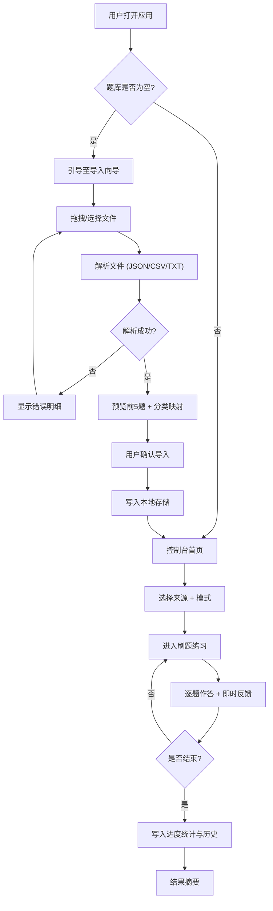

# 刷题软件 产品需求文档（PRD）

## 1. 产品概述

面向工业机器人比赛备赛者（及通用知识刷题用户）的本地化轻量刷题应用。所有题目内容**完全来源于用户导入的题目文件**（JSON / CSV / TXT），软件本身不预置任何题目。通过文件结构自动分类、交互式答题、进度跟踪与错题回顾，帮助用户高效备考。

- 目标用户：工业机器人比赛参赛者、需要按题库进行系统复习的学生与技术人员
- 核心价值：题目来源 100% 由用户掌控，数据完全本地化（无后端、无上传），支持批量导入、灵活刷题与精准进度反馈

---

## 2. 核心功能

### 2.1 用户角色
本应用为单用户本地应用，无注册登录。所有数据存储于浏览器本地（localStorage / IndexedDB）。

| 角色 | 使用方式 | 核心权限 |
|------|----------|----------|
| 本地用户 | 直接打开网页使用 | 导入文件、刷题、查看进度、管理题库、导出数据 |

### 2.2 功能模块

1. **控制台首页（Dashboard）**：导入入口、题库概览统计、上次练习进度恢复、快速开始刷题
2. **题库管理（Question Bank）**：已导入文件列表、按文件/分类查看题目、搜索过滤、单题预览、删除文件、下载示例模板
3. **刷题练习（Practice）**：顺序 / 随机模式、单题作答与即时反馈、解析展示、收藏 / 标记错题、上一题/下一题导航、键盘快捷键
4. **进度统计（Progress）**：总体完成率、正确率、按文件/分类的细分统计、错题本回顾与重做、练习历史时间线
5. **导入向导（Import Wizard）**：拖拽 / 点击批量上传、格式预校验、文件结构映射、分类预览、导入结果报告

### 2.3 页面详情

| 页面 | 模块 | 功能描述 |
|------|------|----------|
| 控制台首页 | 题库概览卡片 | 显示题目总数、已练习数、正确率、错题数，含环形进度图 |
| 控制台首页 | 快速开始 | 选择文件 + 模式（顺序/随机）一键开始刷题 |
| 控制台首页 | 继续上次 | 显示最近一次未完成练习，点击恢复到断点位置 |
| 题库管理 | 文件列表 | 以卡片展示每个导入文件：文件名、题目数、分类、导入时间、操作菜单 |
| 题库管理 | 题目浏览 | 选中文件后展示题目列表（分页/虚拟滚动），支持按题干关键词搜索 |
| 题库管理 | 模板下载 | 提供 JSON / CSV / TXT 三种格式示例模板下载 |
| 导入向导 | 上传区 | 拖拽多文件或点击选择，显示文件队列与格式图标 |
| 导入向导 | 解析预览 | 解析后预览前 5 题，标注题干/选项/答案/解析是否完整，可手动调整分类 |
| 导入向导 | 结果报告 | 导入成功/失败/跳过数量、错误明细（如某行格式不符）、确认入库 |
| 刷题练习 | 题目卡片 | 题号、题型标签、题干（支持多行）、选项列表（单选/多选/判断） |
| 刷题练习 | 作答交互 | 点选选项、提交按钮、提交后高亮正确/错误、显示解析 |
| 刷题练习 | 控制条 | 上一题 / 下一题 / 收藏 / 标记错题 / 题号跳转 / 进度条 |
| 刷题练习 | 模式切换 | 顺序模式 / 随机模式切换（随机模式打乱当前文件题目顺序） |
| 进度统计 | 总览面板 | 累计答题数、正确率趋势、连续练习天数 |
| 进度统计 | 细分统计 | 按文件 / 分类维度展示完成率与正确率条形图 |
| 进度统计 | 错题本 | 列出所有错题与标记题，支持"仅错题重做"练习模式 |
| 进度统计 | 练习历史 | 时间线展示每次练习会话：时长、题数、正确率 |

---

## 3. 核心流程

### 3.1 导入流程
用户进入导入向导 → 拖拽/选择一个或多个 JSON/CSV/TXT 文件 → 系统依次解析每个文件 → 按文件格式提取题干、选项、答案、解析 → 自动按文件名或文件内 category 字段归类 → 预览前 5 题并标注字段完整性 → 用户确认分类与导入 → 写入本地存储 → 返回结果报告（成功/失败/跳过数与错误明细）→ 题库与控制台统计同步更新。

### 3.2 刷题流程
用户在控制台或题库页选择来源（文件/分类/错题本）→ 选择模式（顺序/随机）→ 进入练习 → 逐题作答 → 提交后即时反馈正误与解析 → 可收藏或标记错题 → 顶部进度条实时更新 → 用户主动结束或完成全部题目 → 写入练习历史与进度统计 → 返回结果摘要。

### 3.3 流程图

---

## 4. 用户界面设计

### 4.1 设计风格

**美学方向：工程蓝图 × 工业控制台（Engineering Blueprint × Industrial Console）**

整体气质取自工业机器人控制室的精密感与机械制图蓝图的严谨性，融合为现代学习工具的克制美学。

- **主色与配色**：
  - 背景：深炭灰 `#0E1116`（主）/ 蓝图蓝 `#0F1B2A`（次面板）
  - 主前景：`#E8EDF2`（高对比文字）
  - 强调色：电光青 `#22D3EE`（主操作 / 正确）/ 警示琥珀 `#F59E0B`（错误 / 标记）/ 蓝图线 `#3B82F6`（链接 / 次要）
  - 网格线：`rgba(34, 211, 238, 0.08)`（蓝图底纹）
- **按钮风格**：直角微圆（2px），主按钮为青色实心 + 微发光阴影；次按钮为描边 + 悬浮填充；危险按钮琥珀描边
- **字体**：
  - 显示字体：`Space Mono`（标题、题号、技术感数据）—— 等宽工程感
  - 正文字体：`IBM Plex Serif`（题干、解析）—— 长文阅读舒适
  - UI 字体：`IBM Plex Sans`（按钮、标签、导航）—— 清晰中性
- **布局风格**：基于 12 列蓝图栅格，卡片之间用 1px 青色细线分隔，模拟制图分格；顶部固定导航条 + 左侧主内容区
- **图标 / emoji 风格**：线性图标（lucide-react 风格），1.5px 描边，与蓝图线稿一致；避免彩色 emoji
- **背景与纹理**：蓝图栅格底纹 + 局部噪点叠加 + 卡片悬停时的青色微光描边

### 4.2 页面设计概览

| 页面 | 模块 | UI 元素 |
|------|------|--------|
| 控制台首页 | 顶部导航 | 左 Logo + 中间标签页（控制台/题库/练习/进度）+ 右"导入"按钮 |
| 控制台首页 | 概览卡片 | 4 张统计卡：题目总数 / 已练习 / 正确率 / 错题数，每卡含数字 + 环形或条形迷你图 |
| 控制台首页 | 快速开始面板 | 蓝图风格面板：选择来源下拉 + 模式切换 + 大号青色"开始练习"按钮 |
| 控制台首页 | 继续上次 | 横向小卡片：文件名 + 进度百分比 + 断点题号 + "恢复"按钮 |
| 题库管理 | 文件列表 | 网格卡片，每卡含文件图标 + 名称 + 分类标签 + 题数 + 导入日期 + 操作菜单（查看/练习/删除） |
| 题库管理 | 题目浏览 | 右侧抽屉式列表：题号 + 题干摘要 + 题型标签 + 收藏/错题标记，支持搜索框 |
| 导入向导 | 上传区 | 大号虚线拖拽区，蓝图栅格背景 + 青色描边 + 悬浮发光，下方文件队列列表 |
| 导入向导 | 解析预览 | 表格式预览：每行一题，列含 题干/选项/答案/解析/状态图标，缺失项琥珀标注 |
| 刷题练习 | 题目卡片 | 居中大卡片：顶部题号+题型标签，中部题干（衬线大字），下部选项（每项带字母前缀 A/B/C/D） |
| 刷题练习 | 反馈区 | 提交后展开：正确答案高亮 + 用户选择标注 + 解析面板（琥珀左边框） |
| 刷题练习 | 控制条 | 底部固定栏：左 上一题/收藏/标记错题，中 进度条+题号，右 下一题/跳转 |
| 进度统计 | 总览面板 | 大号正确率环形图 + 累计答题数 + 连续天数，配趋势折线 |
| 进度统计 | 细分条形图 | 每文件/分类一行：完成率条 + 正确率条，并排对比 |
| 进度统计 | 错题本 | 卡片网格：题干摘要 + 来源文件 + "重做"按钮，支持筛选 |
| 进度统计 | 历史时间线 | 左侧时间轴 + 右侧会话卡片：日期/时长/题数/正确率 |

### 4.3 响应式
桌面优先（1280px+ 最佳体验），平板（768-1280px）侧栏折叠为图标，移动端（<768px）单列堆叠、导航变底部 Tab、题目卡片全屏。触控优化：选项点击区域 ≥44px，支持滑动手势切换题目。

### 4.4 动效
- 页面载入：蓝图栅格淡入 + 卡片错峰上浮（staggered reveal）
- 题目切换：左右滑动 + 淡入淡出（300ms）
- 提交反馈：正确项青色脉冲，错误项琥珀抖动
- 数字统计：CountUp 动画
- 悬停：卡片青色描边发光 + 微抬升
