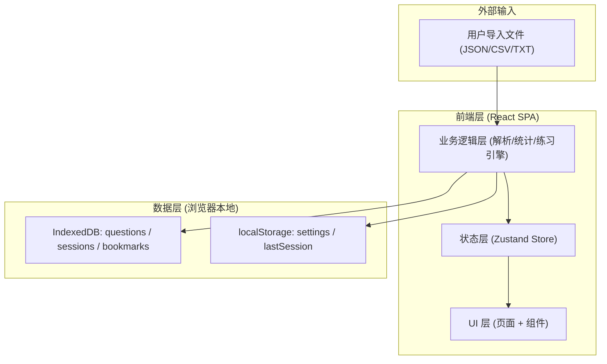
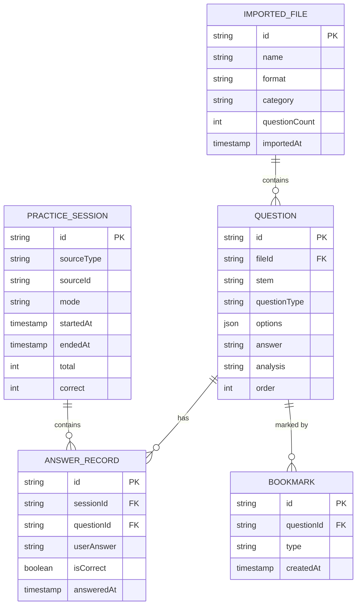

# 刷题软件 技术架构文档

## 1. 架构设计

纯前端单页应用，无后端服务。所有数据持久化于浏览器本地存储（IndexedDB 存题目与历史，localStorage 存设置与会话状态）。文件解析在浏览器内完成，不上传任何数据。



## 2. 技术说明

- **前端框架**：React@18 + TypeScript
- **构建工具**：Vite@5（`vite-init` 初始化，React + TS 模板）
- **样式方案**：Tailwind CSS@3 + CSS 变量（蓝图主题色）
- **状态管理**：Zustand（轻量，适合本地数据场景）
- **路由**：React Router@6
- **本地存储**：Dexie.js（IndexedDB 封装，存储题目与练习历史）
- **PDF 解析**：pdfjs-dist@4（通过 `?url` 引入 worker，提取文本后走 TXT 解析）
- **图标**：lucide-react
- **图表**：自绘 SVG（环形/条形/折线），避免重型图表库
- **字体**：Google Fonts 加载 `Space Mono` / `IBM Plex Serif` / `IBM Plex Sans`
- **后端**：无
- **数据库**：无（使用浏览器 IndexedDB）

## 3. 路由定义

| 路由 | 用途 |
|------|------|
| `/` | 控制台首页：题库概览、快速开始、继续上次 |
| `/bank` | 题库管理：文件列表与题目浏览 |
| `/import` | 导入向导：上传、解析预览、确认导入 |
| `/practice/:sourceId` | 刷题练习：sourceId 可为 fileId / `category/:name` / `wrongbook` |
| `/progress` | 进度统计：总览、细分、错题本、历史 |
| `*` | 404 重定向至 `/` |

## 4. 数据模型

### 4.1 实体关系



### 4.2 题目数据结构（运行时）

```typescript
interface Question {
  id: string;                    // UUID
  fileId: string;                // 所属导入文件
  stem: string;                  // 题干
  questionType: 'single' | 'multiple' | 'judge'; // 单选/多选/判断
  options: { key: string; text: string }[]; // 选项 [{key:'A', text:'...'}]
  answer: string;                // 正确答案，多选为 "ACD"，判断为 "T"/"F"
  analysis: string;              // 解析
  order: number;                 // 在文件中的序号
}

interface ImportedFile {
  id: string;
  name: string;                  // 文件名（去扩展名）
  format: 'json' | 'csv' | 'txt';
  category: string;              // 分类（文件名或文件内字段）
  questionCount: number;
  importedAt: number;
}

interface PracticeSession {
  id: string;
  sourceType: 'file' | 'category' | 'wrongbook';
  sourceId: string;
  mode: 'sequential' | 'random';
  startedAt: number;
  endedAt: number | null;
  total: number;
  correct: number;
  records: AnswerRecord[];
}

interface AnswerRecord {
  questionId: string;
  userAnswer: string;
  isCorrect: boolean;
  answeredAt: number;
}

interface Bookmark {
  questionId: string;
  type: 'favorite' | 'wrong';    // 收藏 / 错题
  createdAt: number;
}
```

### 4.3 导入文件格式规范

#### JSON 格式（推荐）
```json
{
  "category": "工业机器人基础",
  "questions": [
    {
      "stem": "工业机器人的自由度是指什么？",
      "type": "single",
      "options": [
        {"key": "A", "text": "机器人手部所能到达的位置数"},
        {"key": "B", "text": "机器人独立运动的坐标轴数"},
        {"key": "C", "text": "机器人关节数量"},
        {"key": "D", "text": "机器人负载能力"}
      ],
      "answer": "B",
      "analysis": "自由度指机器人所具有的独立运动坐标轴数，通常等于关节数。"
    }
  ]
}
```
- 顶层可选 `category` 字段；缺省时以文件名作为分类
- `type` 可选值：`single` / `multiple` / `judge`；判断题 options 可省略，answer 为 `"T"` 或 `"F"`
- `analysis` 可选

#### CSV 格式
列顺序：`stem,type,options,answer,analysis`
- `options` 用 `|` 分隔，每项格式 `A.选项文本`
- 示例：
```csv
stem,type,options,answer,analysis
工业机器人的自由度是指什么？,single,A.机器人手部所能到达的位置数|B.机器人独立运动的坐标轴数|C.机器人关节数量|D.机器人负载能力,B,自由度指机器人所具有的独立运动坐标轴数
```
- 含逗号的字段需用双引号包裹；分类取文件名（去扩展名）

#### TXT 格式（行式自然语言解析）
```
# 分类：工业机器人基础
# 题型：单选

1. 工业机器人的自由度是指什么？
A. 机器人手部所能到达的位置数
B. 机器人独立运动的坐标轴数
C. 机器人关节数量
D. 机器人负载能力
答案：B
解析：自由度指机器人所具有的独立运动坐标轴数，通常等于关节数。

2. [多选] 下列属于工业机器人常见坐标系的有？
A. 基坐标系
B. 关节坐标系
C. 工具坐标系
D. 用户坐标系
答案：ABCD
解析：工业机器人常见坐标系包括基坐标系、关节坐标系、工具坐标系和用户坐标系。
```
- 以 `# 分类：xxx` / `# 题型：xxx` 行设置全局分类与默认题型（可被 `[多选]` `[判断]` 行内标记覆盖）
- 题目以 `数字.` 开头；题型可在题干前以 `[单选]/[多选]/[判断]` 标注
- 选项以 `A.` `B.` 等开头
- `答案：` 行指定答案；`解析：` 行指定解析
- 题目之间以空行分隔

#### PDF 格式
- PDF 内部排版需符合上述 TXT 格式规范
- 用 pdfjs-dist 提取各页文本项（带坐标），经 `reconstructLines` 按 Y 坐标分行、行内按 X 排序重排为纯文本，再走 `parseTxt` 解析
- 仅支持文本型 PDF；扫描件/图片型 PDF 无法提取文本（暂不支持 OCR），会抛出明确错误提示
- 分类默认取文件名（去扩展名），或由 PDF 内首部 `# 分类：xxx` 行指定

### 4.4 解析器职责
- `parseJson(text)`：JSON.parse + schema 校验，字段缺失时填充默认值并标记 warning
- `parseCsv(text)`：按行 split，处理引号包裹字段，按列映射
- `parseTxt(text)`：状态机解析，识别分类行、题型行、题干行、选项行、答案行、解析行
- `parsePdf(file)`：异步，pdfjs 提取文本 → `reconstructLines` 重排 → `parseTxt` 解析
- `reconstructLines(items)`：纯函数，按坐标将散乱文本项重排为行式文本（独立可测）
- 统一返回 `{ file, questions, warnings }` 结构，warnings 用于导入预览页展示

## 5. IndexedDB Schema（Dexie）

```typescript
db.version(1).stores({
  files: 'id, name, category, importedAt',
  questions: 'id, fileId, order, [fileId+order]',
  sessions: 'id, sourceType, sourceId, startedAt',
  bookmarks: 'questionId, type, createdAt'
});
```

## 6. 关键模块说明

### 6.1 解析引擎（`src/lib/parsers/`）
- `detectFormat(filename)`：根据扩展名分发
- `parseFile(file)`：返回 `{ file: ImportedFile, questions: Question[], warnings: Warning[] }`
- 解析失败不中断整体导入，单题失败记入 warnings 并跳过

### 6.2 练习引擎（`src/lib/practice/`）
- `buildSequence(source, mode)`：根据来源与模式生成题目序列（随机模式用 Fisher-Yates 洗牌）
- `checkAnswer(question, userAnswer)`：判定正误，多选需排序后字符串比较
- 会话状态保存于 Zustand + localStorage（断点恢复）

### 6.3 统计引擎（`src/lib/stats/`）
- `getOverview()`：聚合题库总数、已答题数、正确率、错题数
- `getBreakdown(by: 'file' | 'category')`：按维度返回完成率与正确率
- `getHistory()`：返回练习会话时间线

## 7. 文件结构

```
src/
├── main.tsx
├── App.tsx
├── index.css                 # Tailwind + 蓝图主题变量
├── pages/
│   ├── Dashboard.tsx
│   ├── QuestionBank.tsx
│   ├── ImportWizard.tsx
│   ├── Practice.tsx
│   └── Progress.tsx
├── components/
│   ├── layout/               # 顶栏、侧栏、布局壳
│   ├── ui/                   # Button、Card、Modal、Tag 等基础组件
│   ├── dashboard/            # 概览卡、快速开始、继续上次
│   ├── bank/                 # 文件卡、题目列表、模板下载
│   ├── import/               # 上传区、解析预览、结果报告
│   ├── practice/             # 题目卡、控制条、反馈区
│   └── progress/             # 环形图、条形图、错题卡、时间线
├── lib/
│   ├── db.ts                 # Dexie 初始化
│   ├── parsers/              # json/csv/txt 解析器
│   ├── practice/             # 练习引擎
│   ├── stats/                # 统计引擎
│   └── utils.ts
├── store/
│   └── useAppStore.ts        # Zustand 全局状态
└── types/
    └── index.ts
```
